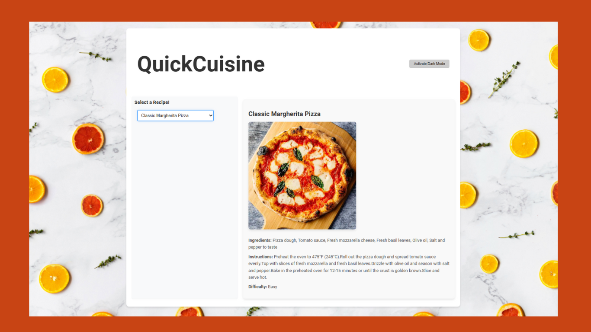

# QuickCuisine - Fast and Delicious Recipes

QuickCuisine is a React-based web application designed to provide a fast, efficient way to explore and share delicious recipes. This application utilizes a service worker to enhance performance through API caching and offers a dark mode feature for a customizable user experience.

**QuickCuisine Screenshot**

- **Recipe Selection Dropdown**: Users can select a recipe from a dropdown menu populated with names fetched from an external API.
- **Recipe Details Display**: Upon selecting a recipe, details such as ingredients, instructions, and difficulty level are displayed.
- **Service Worker Implementation**: Implements a service worker to cache API responses for offline access and faster subsequent loads.
- **Dark Mode**: Allows users to toggle between light and dark themes for ease of use under different lighting conditions.
- **Responsive Design**: Fully responsive layout that adapts to various screen sizes for optimal viewing on any device.

## Demo Video

Watch a quick demo of the application in action here:

## Getting Started

These instructions will get you a copy of the project up and running on your local machine for development and testing purposes.

### Prerequisites

What you need to install the software:

- [Node.js](https://nodejs.org/)
- [npm](https://www.npmjs.com/)

### Installing

A step-by-step series of examples that tell you how to get a development environment running:

Clone the repository:

`git clone https://github.com/arzucaner/react-recipe-app`

Install NPM packages:

`cd QuickCuisine npm install`

Start the development server:

 `npm start`

This runs the app in the development mode. Open http://localhost:3001 to view it in the browser.

## Using the Application

- **Select a Recipe**: Use the dropdown menu to choose a recipe.
- **View Recipe Details**: After selecting a recipe, the details will be displayed below the dropdown.
- **Toggle Dark Mode**: Use the button in the header to switch themes.

## Built With

- **React** - The web framework used
- **Create React App** - Used to bootstrap the initial setup
- **Service Workers** - For caching API responses and enabling offline functionality
- **DummyJSON** - API for fetching recipe data

## Deployment

This project is deployed on Netlify.

## Live Demo

You can view the deployed app at [QuickCuisine](https://equickcuisinerecipe.netlify.app/). This live demo allows you to interact with the application and explore its features in real-time.

## Authors

- **Arzu Caner**

## Acknowledgments

- Hat tip to anyone whose code was used
- Inspiration
- etc
